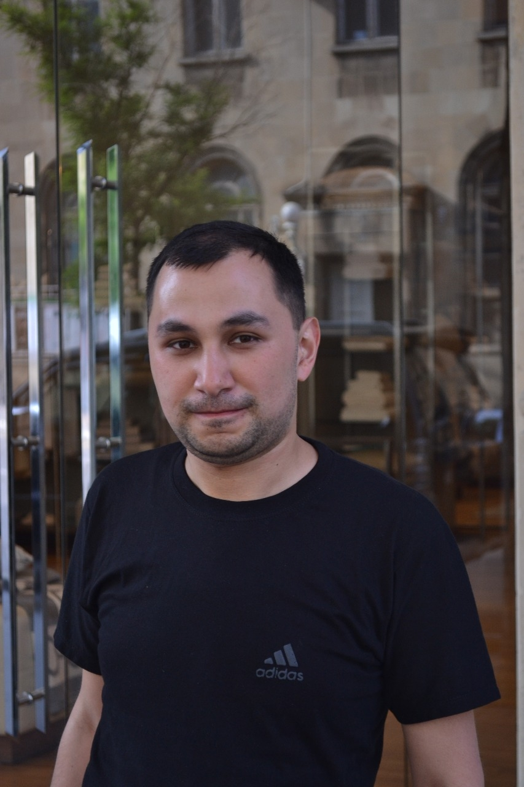
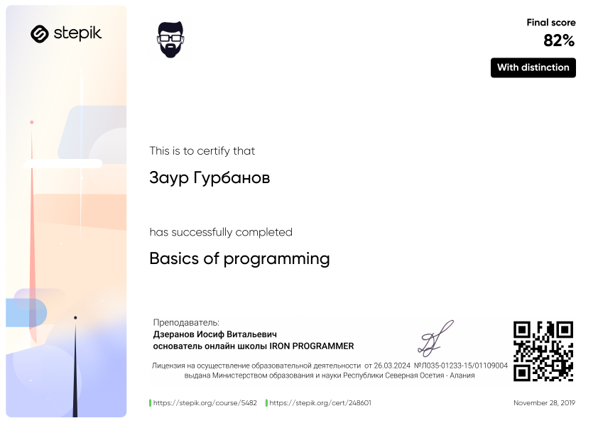
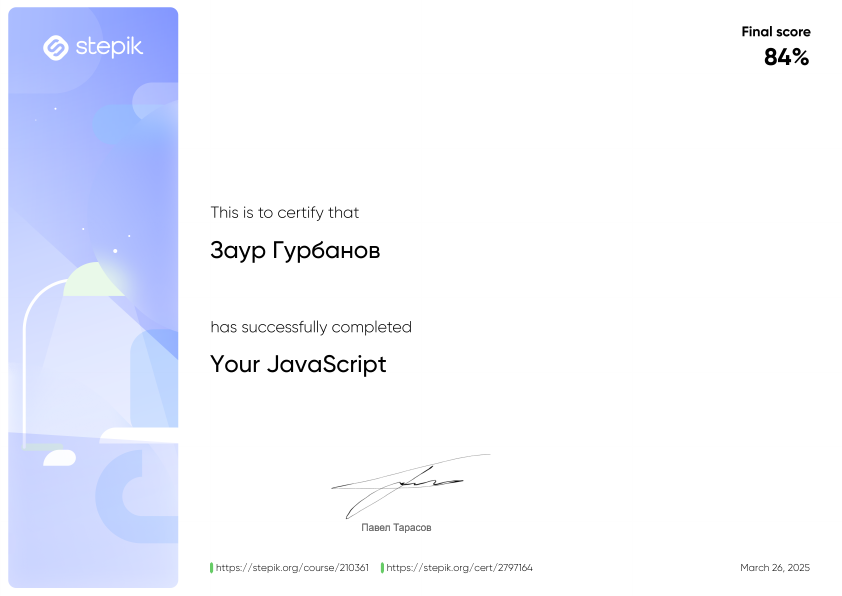
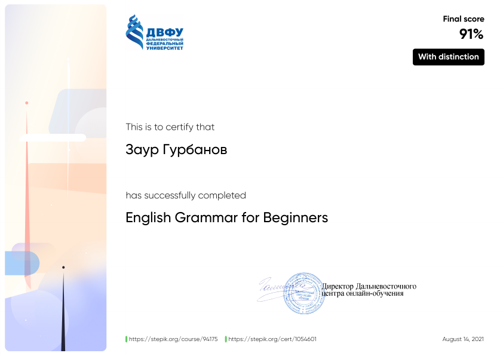

# Zaur Gurbanov

---

## **Junior Frontend Developer**



---

**Contact information:**
**Phone:** +994 51 619 27 47
**E-mail:** mr.zaur.gurbanov@gmail.com
**Telegram:** @vazovsky0

---

**Briefly About Myself:**
I hold a bachelor's degree in computer engineering. I have experience coding in a variety of languages and have decided to pursue a career as a programmer. I have chosen to begin my career in web development. I am currently pursuing opportunities for professional development in this field. At some point in the future, I may decide to transition to a different profession, such as mobile development. The future will reveal the specifics. However, my primary professional goal is to create and develop my own products.

---

- HTML5, CSS3
- JavaScript
- Git, GitHub
- VS Code, IntelliJ IDEA

---

**Code example:**
**_Task: Count the Digit_**
_Description:_
Take an integer n (n >= 0) and a digit d (0 <= d <= 9) as an integer.
Square all numbers k (0 <= k <= n) between 0 and n.
Count the numbers of digits d used in the writing of all the k\*\*2.
Implement the function taking n and d as parameters and returning this count.

Examples:
_n = 10, d = 1_
_the k\*k are 0, 1, 4, 9, 16, 25, 36, 49, 64, 81, 100_
_We are using the digit 1 in: 1, 16, 81, 100. The total count is then 4._

_The function, when given n = 25 and d = 1 as argument, should return 11 since_
*the k*k that contain the digit 1 are:\*
_1, 16, 81, 100, 121, 144, 169, 196, 361, 441._
_So there are 11 digits 1 for the squares of numbers between 0 and 25._
_Note that 121 has twice the digit 1._

**_JS Code:_**

```
function nbDig(n, d) {
    let num = 0, count = 0;
    let char = d + '';
    for (let i = 0; i <= n; i++) {
        num = i * i + '';
        for (const elem of num) {
            if (elem.includes(char))
                count++;
        }
    }
    return count;
}
```

---

**Completed courses:**





---

**Uncompleted courses:**

- IT Step
- My codewars level:
  

---

**Languages:**

- English - Elementary
  
- Russian - Native
- Turkish - Intermediate
